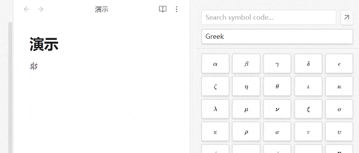

# LaTeX Helper | LaTeX 助手

A powerful and convenient LaTeX symbol panel for Obsidian to enhance your mathematical and scientific note-taking efficiency.

This plugin provides a feature-rich panel that integrates seamlessly into your Obsidian workspace, helping you find and insert complex LaTeX symbols and snippets with ease.

---

## English

### ✨ Features

-   **Comprehensive Symbol Library**: A clean, dropdown-based UI with a vast collection of LaTeX symbols across multiple categories (Greek, Operators, Arrows, etc.).
-   **Real-time Search**: Instantly find the symbol you need by searching its LaTeX code within the currently selected category.
-   **Seamless Window Management**: Easily switch between a docked sidebar panel and a floating pop-out window using a smart, context-aware button.
-   **Multi-language Support**: A fully translated interface that supports both **English** and **Chinese**, which can be configured in the plugin's settings.
-   **Smart Editing Workflow**:
    -   Automatically adds a space after inserting a symbol to improve readability and speed.
    -   Reliably returns the cursor focus to the editor after insertion, ensuring an uninterrupted writing flow.

### 🚀 How to Use

1.  After installing the plugin, click the **Sigma (Σ) icon** in the left ribbon to open the LaTeX Helper panel in the sidebar.
2.  Use the **dropdown menu** at the top of the panel to switch between symbol categories.
3.  Use the **search bar** to filter symbols in the current category by their LaTeX code (e.g., type `alpha` to find `\alpha`).
4.  Click any symbol button to insert it directly into your active note.
5.  Click the **pop-out/dock icon** next to the search bar to toggle the panel between the sidebar and a floating window.
6.  To change the language, go to `Settings` -> `LaTeX Helper` and select your preferred language from the dropdown. The panel will refresh automatically.

### 🖼️ Screenshot

---
---
---

## 中文

### ✨ 功能特性

-   **全面的符号库**：一个界面整洁、基于下拉菜单的符号面板，包含了多个分类下（希腊字母、运算符、箭头等）的大量常用 LaTeX 符号。
-   **实时搜索**：在当前分类下，通过输入符号的 LaTeX 代码来即时查找您需要的符号。
-   **无缝窗口管理**：通过一个智能的、能感知上下文的按钮，轻松地在侧边栏停靠模式和独立的浮动窗口模式之间切换。
-   **多语言支持**：完全翻译的用户界面，支持**中文**和**英文**，并可在插件设置中自由切换。
-   **智能编辑工作流**：
    -   插入符号后自动添加空格，提高可读性与输入速度。
    -   插入操作后，可靠地将光标焦点返回至编辑器，确保您的写作流程不被打断。

### 🚀 如何使用

1.  安装插件后，点击 Obsidian 左侧功能区的 **Sigma (Σ) 图标**，即可在侧边栏打开 LaTeX 助手面板。
2.  使用面板顶部的**下拉菜单**来切换不同的符号分类。
3.  使用**搜索框**，通过输入 LaTeX 代码来筛选当前分类下的符号（例如，输入 `alpha` 来查找 `\alpha`）。
4.  点击任意符号按钮，即可将其插入到您当前正在编辑的笔记中。
5.  点击搜索框旁边的**弹出/停靠图标**，可以在侧边栏模式和浮动窗口模式之间切换面板。
6.  如需切换语言，请进入 `设置` -> `LaTeX 助手`，在下拉菜单中选择您偏好的语言，面板将自动刷新。

### 🖼️ 截图演示

